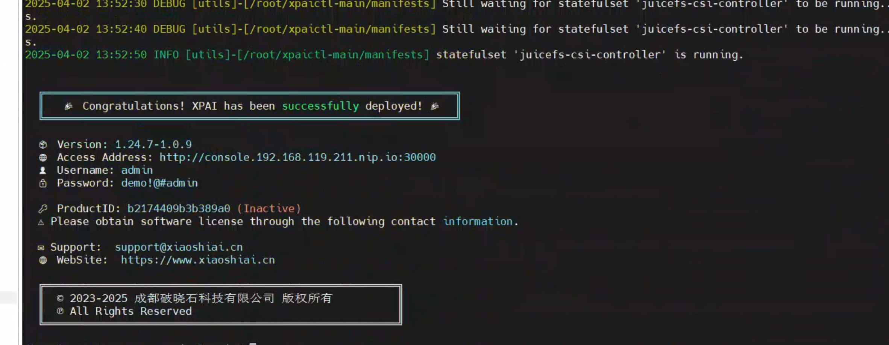

# XPAI 平台部署工具使用手册

## 文档信息

<table>
<thead>
<tr>
<th>项目</th>
<th>说明</th>
</tr>
</thead>
<tbody>
<tr>
<td>文档名称</td>
<td>XPAI 平台部署工具使用手册</td>
</tr>
<tr>
<td>工具名称</td>
<td>xpaictl</td>
</tr>
<tr>
<td>文档版本</td>
<td>1.0</td>
</tr>
<tr>
<td>更新日期</td>
<td>2025.11.17</td>
</tr>
</tbody>
</table>

---

## 目录

1. [概述](#概述)
2. [系统要求](#系统要求)
3. [构建离线镜像包](#构建离线镜像包)
4. [安装部署](#安装部署)
5. [平台激活](#平台激活)
6. [平台卸载](#平台卸载)
7. [注意事项](#注意事项)
8. [高级功能](#高级功能)

---

## 概述

xpaictl 是 XPAI 平台的自动化部署工具，支持在线和离线两种部署模式。本工具默认提供安装部署脚本，不包含离线安装的镜像包。由于离线包中 XPAI 的扩展镜像包含大量 AI 框架，导致镜像体积较大，不便于传输。用户可通过运行 make 命令在本地构建 XPAI 的离线镜像包。

### 主要功能

- 支持在线和离线两种部署模式
- 支持单节点、多节点集群部署
- 支持高可用多 Master 节点部署
- 自动化镜像构建和打包
- 一键式平台安装和卸载

---

## 系统要求

### 前置条件

- 操作系统：Linux（推荐 Ubuntu 22.04+）
- 构建环境：需要安装 `make` 工具
- 网络环境：在线部署需要可访问镜像仓库；离线部署需要预先构建离线镜像包
- 权限要求：需要 root 权限执行部署脚本
- GPU 驱动：目标节点需预先安装 GPU 驱动（本工具不包含驱动安装）

### 集群要求

- 所有节点 SSH 端口和 root 密码需保持一致
- 确保节点间网络互通
- 建议节点时间同步（NTP）

---

## 构建离线镜像包

### 1. 安装构建工具

构建前请确保已安装 `make` 工具：

```bash
# CentOS/RHEL
yum install -y make

# Ubuntu/Debian
apt-get update && apt-get install -y make
```

### 2. 配置文件准备

在构建离线镜像包之前，请确认部署的 XPAI 版本类型：

- **标准版本**：晓石版本（默认）
- **OEM 版本**：厂家定制版本

如为 OEM 版本，请在 `xpai.yaml` 配置文件中修改以下内容：

```yaml
productSuffix: <厂家名称>
# 示例：云易捷版本配置
# productSuffix: qcloud
```

### 3. 执行镜像构建

镜像分为 `stack` 和 `extension` 两个离线包：

- **stack**：包含整个 XPAI 平台运行所需的核心镜像
- **extension-nvidia**：(英伟达扩展包)包含 XPAI 平台内建模、推理和训练框架镜像
- **extension-ascend**：(华为昇腾扩展包)包含 XPAI 平台内建模、推理和训练框架镜像

执行构建命令：

```bash
# 构建 stack 包
make package

# 如果网络条件允许，构建离线 extension-nvidia 包
make package-extension-nvidia

# 构建离线 extension-ascend 华为昇腾环境包
make package-extension-ascend
```

### 4. 构建结果

执行完成后，离线镜像将保存在 `artifacts/images` 目录下。请将本工程整体（包含离线镜像）拷贝到目标安装机器上。

---

## 安装部署

### 1. 准备工作

#### 1.1 传输部署包

将本工程（包含离线镜像）拷贝到目标节点。

#### 1.2 配置文件检查

检查并配置 `xpai.yaml` 文件，详细配置说明请参考文件内注释。

#### 1.3 集群主机确认

<blockquote style="margin: 1em 0; padding: 1em 1.5em; border-left: 4px solid #faad14; background-color: #fffbe6; border-radius: 4px; font-style: normal;">
<strong style="color: #faad14;">⚠️ 重要提示：</strong> 根据 `xpai.yaml` 内的 SSH 配置，确保集群内所有主机的 SSH 端口、root 密码保持一致。
</blockquote>

#### 1.4 GPU 驱动准备

<blockquote style="margin: 1em 0; padding: 1em 1.5em; border-left: 4px solid #1890ff; background-color: #e6f7ff; border-radius: 4px; font-style: normal;">
<strong style="color: #1890ff;">ℹ️ 说明：</strong> 本工具默认不安装显卡驱动。由于离线环境显卡驱动和版本要求难以统一控制，安装过程不包含驱动安装。请在目标主机上自行安装符合要求的 GPU 驱动。
</blockquote>

### 2. 在线部署

#### 2.1 单节点部署

部署单节点（172.16.1.1）的 XPAI 平台：

```bash
./xpaictl.sh --config xpai.yaml --masters 172.16.1.1
```

#### 2.2 单 Master 多节点部署

部署单 Master（172.16.1.1）和 3 个计算节点（172.16.1.2, 172.16.1.3, 172.16.1.4）的 XPAI 平台：

```bash
./xpaictl.sh --config xpai.yaml --masters 172.16.1.1 --nodes 172.16.1.2,172.16.1.3,172.16.1.4
```

#### 2.3 高可用多 Master 部署

部署 3 个 Master 节点（172.16.1.1, 172.16.1.2, 172.16.1.3）和 3 个计算节点（172.16.1.4, 172.16.1.5, 172.16.1.6）的 XPAI 平台：

```bash
./xpaictl.sh --config xpai.yaml --masters 172.16.1.1,172.16.1.2,172.16.1.3 --nodes 172.16.1.4,172.16.1.5,172.16.1.6
```

### 3. 离线部署

<blockquote style="margin: 1em 0; padding: 1em 1.5em; border-left: 4px solid #1890ff; background-color: #e6f7ff; border-radius: 4px; font-style: normal;">
<strong style="color: #1890ff;">ℹ️ 说明：</strong> 在离线环境下部署，请先在有网环境下「执行镜像构建」步骤后，再将本项目整体拷贝到目标机器上进行安装。
</blockquote>

#### 3.1 单节点离线部署

离线部署单节点（172.16.1.1）的 XPAI 平台：

```bash
./xpaictl.sh --config xpai.yaml --masters 172.16.1.1 --offline
```

#### 3.2 高可用多 Master 离线部署

离线部署 3 个 Master 节点（172.16.1.1, 172.16.1.2, 172.16.1.3）和 3 个计算节点（172.16.1.4, 172.16.1.5, 172.16.1.6）的 XPAI 平台：

```bash
./xpaictl.sh --config xpai.yaml --masters 172.16.1.1,172.16.1.2,172.16.1.3 --nodes 172.16.1.4,172.16.1.5,172.16.1.6 --offline
```

---

## 平台激活

部署完成后，系统会输出 License 信息。请使用该 License 信息联系授权方获取授权并完成平台激活。

激活界面示例：



---

## 平台卸载

如需卸载 XPAI 平台，执行以下命令即可将环境重置：

```bash
make reset
```

<blockquote style="margin: 1em 0; padding: 1em 1.5em; border-left: 4px solid #ff4d4f; background-color: #fff1f0; border-radius: 4px; font-style: normal;">
<strong style="color: #ff4d4f;">🚨 警告：</strong> 执行卸载操作将清除所有平台数据，包括 License重置，请谨慎操作。
</blockquote>

---

## 注意事项

### 1. 缓存盘配置

缓存盘需要手动写入到 `/etc/fstab` 中，以确保系统重启后自动挂载。所有节点都需要进行配置：

```bash
# 示例配置（请根据实际磁盘设备调整）
/dev/sdb /var/jfsCache/ xfs defaults 0 0
```

配置完成后执行：

```bash
mount -a
```

### 2. 内核参数配置（已修复）

~~内核参数需要手动持久化到 `/etc/sysctl.conf` 中。所有节点都需要进行配置：~~

<blockquote style="margin: 1em 0; padding: 1em 1.5em; border-left: 4px solid #52c41a; background-color: #f6ffed; border-radius: 4px; font-style: normal;">
<strong style="color: #52c41a;">✅ 说明：</strong> 此问题已在最新版本中修复，无需手动配置。
</blockquote>

```bash
# 如遇问题，可手动添加以下配置（所有节点）
fs.inotify.max_user_watches=2099999999
fs.inotify.max_user_instances=2099999999
fs.inotify.max_queued_events=2099999999
```

配置完成后执行：

```bash
sysctl -p
```

### 3. MAPI 服务数据库配置（已修复）

~~MAPI 服务部署完成后需要手动设置 deploy 中的 MySQL 密码，并手动创建数据库：~~

<blockquote style="margin: 1em 0; padding: 1em 1.5em; border-left: 4px solid #52c41a; background-color: #f6ffed; border-radius: 4px; font-style: normal;">
<strong style="color: #52c41a;">✅ 说明：</strong> 此问题已在最新版本中修复，无需手动配置。
</blockquote>

```sql
-- 如遇问题，可手动进入 kubegems-pai 数据库执行
CREATE DATABASE mapi;
```

---

## Q&A

### 1.离线环境镜像构建

如需在离线环境中构建镜像，请在部署前先执行以下步骤：

#### 安装 nerdctl 工具

```bash
make nerdctl
```

#### 配置 buildkit 服务

创建 buildkit 服务配置文件：

```bash
cat > /etc/systemd/system/buildkit.service << EOF
[Unit]
Description=Buildkit
Documentation=https://github.com/moby/buildkit
[Service]
ExecStart=/usr/local/bin/buildkitd --oci-worker=false --containerd-worker=true
[Install]
WantedBy=multi-user.target
EOF
```

#### 启动 buildkit 服务

```bash
systemctl enable buildkit
systemctl start buildkit
```

<blockquote style="margin: 1em 0; padding: 1em 1.5em; border-left: 4px solid #1890ff; background-color: #e6f7ff; border-radius: 4px; font-style: normal;">
<strong style="color: #1890ff;">ℹ️ 说明：</strong> nerdctl 是 Docker 的替代工具，适用于 containerd 容器运行时环境。
</blockquote>

### 2. 更换平台域名

XPAI 平台部署完成后，如需更新访问域名，无需重新执行 `xpaictl`安装，按以下步骤依次修改：

#### 修改浏览器访问域名

```
kubectl edit plugin -n kubegems-installer kubegems

...
spec:
  installNamespace: kubegems
  kind: helm
  url: https://charts.kubegems.io/kubegems
  values:
    api:
...
    dashboard:
...
    ingress:
      hostname: console.xpai.xiaoshiai.cn    \\ 将此处替换为新的控制台域名
...
```

#### 修改内部服务域名

```
kubectl edit plugin -n kubegems-installer kubegems-pai

spec:
  chart: kubegems-pai
  installNamespace: kubegems-pai
  kind: helm
  url: https://charts.kubegems.io/kubegems
  values:
    api:
...
    controller:
...
      ingress:
        baseHost: xpai.xiaoshiai.cn         \\ 替换为新的基础泛域名
        className: default-gateway
        tls:
          enabled: true
          existsSecretName: start-develop-xiaoshiai-cn-tls
      s3:
```

<blockquote style="margin: 1em 0; padding: 1em 1.5em; border-left: 4px solid #faad14; background-color: #fffbe6; border-radius: 4px; font-style: normal;">
<strong style="color: #faad14;">⚠️ 重要提示：</strong> 这里baseHost指的泛域名，XPAI 平台内部创建的服务通过它生成随机域名。
</blockquote>

#### 检查结果

```
# 检查 Web 域名是否已生效
kubectl get ing -n kubegems

# 检查内部服务域名是否已生效
kubectl get ing -n kubegems-pai
kubectl get ing -n juicefs-system
```

#### 

如果内部服务域名仍然`没有生效`，可尝试执行命令手动删除 ingress 资源 

```
kubectl delete ing -n kubegems-pai <ing名称> 
```
然后重启`xpai controller`服务之后再继续检查结果

```
kubectl rollout restart deploy kubegems-pai-controller -n kubegems-pai
```


---

## 技术支持

如遇到问题，请通过以下方式获取支持：

1. 查阅本文档的注意事项章节
2. 检查配置文件是否正确
3. 查看部署日志排查问题
4. 联系技术支持团队：<maqing@xiaoshiai.cn>

---

## 附录

### 常用命令参考

<table>
<thead>
<tr>
<th>命令</th>
<th>说明</th>
</tr>
</thead>
<tbody>
<tr>
<td><code>make package</code></td>
<td>构建离线镜像包</td>
</tr>
<tr>
<td><code>make nerdctl</code></td>
<td>安装 nerdctl 工具</td>
</tr>
<tr>
<td><code>./xpaictl.sh --config xpai.yaml --masters &lt;IP&gt;</code></td>
<td>单节点部署</td>
</tr>
<tr>
<td><code>./xpaictl.sh --config xpai.yaml --masters &lt;IP&gt; --nodes &lt;IPs&gt; --offline</code></td>
<td>离线多节点部署</td>
</tr>
<tr>
<td><code>make reset</code></td>
<td>卸载平台</td>
</tr>
</tbody>
</table>

---

文档结束
