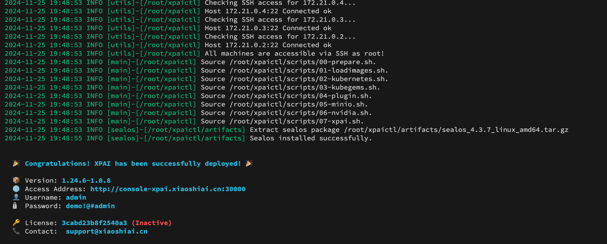

## xpaictl 使用说明

本工程默认提供的是安装部署脚本，不含离线安装的镜像包。由于离线包中xpai的扩展镜像内包含大量AI框架导致镜像提及较大不方便传输。
用户拿到本脚本后通过运行make命令可在本地构建出xpai的离线镜像包。


### 构建离线镜像包

依赖make命令，构建前请安装make

1. 配置文件 `xpai.yaml`

在构建离线镜像包之前，确认部署xpai的版本是晓石还是厂家OEM版本。如果是OEM版本，请在xpai.yaml配置文件中修改如下内容

```yaml
productSuffix: <厂家名称>
# 例如： 云易捷版本配置
# productSuffix: qcloud
```

2. 执行构建镜像

镜像分为 stack 和 extension 两个离线包。

- stack 包含整个 xpai 平台 运行所需要的镜像
- extension 包含 xpai 平台内建模、推理和训练框架镜像

```bash
#构建stack包
make package

#构建extension包
make package-extension
```

执行完成后，离线镜像会保存在 `artifacts/images`目录下，此时将本工程整体拷贝到被安装机器上开始安装


### 安装xpai

讲本工程（包含离线镜像）拷贝到目标节点


1. 配置文件 `xpai.yaml`

配置说明参考文件内说明

2. 确定被安装的集群主机

> NOTES： 根据xpai.yaml 内的ssh配置，确保集群内所有主机的ssh端口、root密码一致

3. 显卡驱动

默认不安装显卡驱动，由于离线环境显卡驱动和版本要求都比较难以控制，所以安装过程不含驱动的安装。这部分需要用户在目标主机上自行安装GPU驱动。

##### 在线部署样例：

- 部署单节点(172.16.1.1)的XPAI平台

```bash
./xpaictl.sh --config xpai.yaml --masters 172.16.1.1
```

- 部署单master(172.16.1.1),3计算节点（172.16.1.2,172.16.1.3,172.16.1.4）的XPAI平台

```bash
./xpaictl.sh --config xpai.yaml --masters 172.16.1.1 --nodes 172.16.1.2,172.16.1.3,172.16.1.4
```

- 部署单3master(172.16.1.1,172.16.1.2,172.16.1.3),3计算节点（172.16.1.4,172.16.1.5,172.16.1.6）的XPAI平台

```bash
./xpaictl.sh --config xpai.yaml --masters 172.16.1.1,172.16.1.2,172.16.1.3 --nodes 172.16.1.4,172.16.1.5,172.16.1.6
```

##### 离线部署样例

- 离线部署单节点(172.16.1.1)的XPAI平台

```bash
./xpaictl.sh --config xpai.yaml --masters 172.16.1.1 --offline
```

- 离线部署单3master(172.16.1.1,172.16.1.2,172.16.1.3),3计算节点（172.16.1.4,172.16.1.5,172.16.1.6）的XPAI平台

```bash
./xpaictl.sh --config xpai.yaml --masters 172.16.1.1,172.16.1.2,172.16.1.3 --nodes 172.16.1.4,172.16.1.5,172.16.1.6 --offline
```

### 激活

部署完成后会输出如下信息，此时需要拿着license信息获取授权激活



### 卸载XPAI

执行命令`sealos reset` 即可将环境重置


### 遗留问题：

1. 缓存盘没有写入到/etc/fstab 中，需要手动配置

```
# 样例,所有节点都需要配置
/dev/sda /var/jfsCache/ xfs defaults 0 0
```

2. 内核的参数没有持久化到/etc/sysctl.conf中，需手动配置

```
# 样例,所有节点都需要配置
fs.inotify.max_user_watches=2099999999
fs.inotify.max_user_instances=2099999999
fs.inotify.max_queued_events=2099999999
```

3. MAPI服务部署完后需要手动设置下 deploy 中的 mysql 密码，和手动创建数据库

```
进入 kubegems-pai 的数据库中创建
create database mapi;
```

4. 如果需要使用在离线环境 build 镜像，则在部署前先执行如下命令

```
make nerdctl


# 配置 buildkit 工具
cat > /etc/systemd/system/buildkit.service << EOF
[Unit]
Description=Buildkit
Documentation=https://github.com/moby/buildkit
[Service]
ExecStart=/usr/local/bin/buildkitd --oci-worker=false --containerd-worker=true
[Install]
WantedBy=multi-user.target
EOF

systemctl enable buildkit
systemctl start buildkit
```

nerdctl是一个 docker 的平替工具